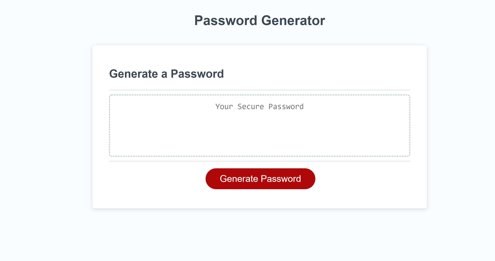
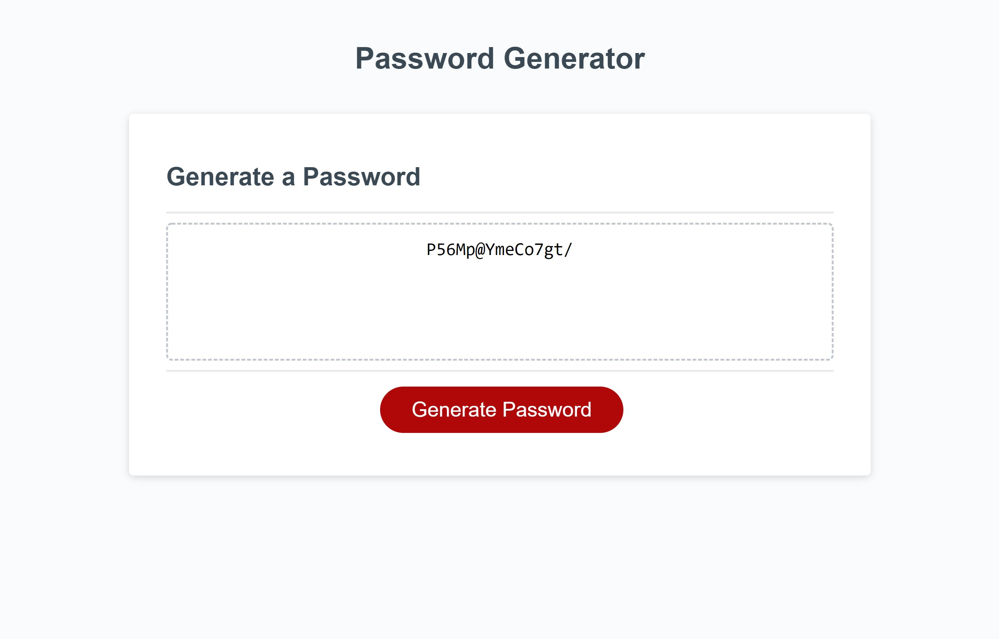

# Password-Generator

Deployed application: https://mlfitz2.github.io/Password-Generator/
GitHub Repository: https://github.com/mlfitz2/Password-Generator

This application is a password generator that allows users to define their own parameters for what their password should be like. The user can select its length (anywhere from 8 to 128 characters) and which types of characters should be included from uppercase letters, lowercase letters, numbers and special characters. 

The application was built using HTML for the user interface and JavaScript for the functionality. 

